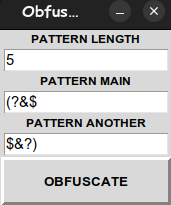

# 🌟 obfuscator
 
## en
obfuscator - hides Python code for security purposes but leaves it executable

---
## 🚀 Possibilities

- ✅ Obfuscate Python Code
- ⚙️ It remains executable
- 📦 Built-in libraries only

---

## 🧰 Installation

```bash
# Clone the repository
git clone https://github.com/VladislavKhudash/Obfuscator.git

# Launch
python obfuscator.py
```



<br><br><br><br>

## ru
obfuscator - скрывает код Python в целях безопасности, но оставляет его исполняемым

---
## 🚀 Возможности

- ✅ Запутывает код Python
- ⚙️ Он остается исполняемым
- 📦 Только встроенные библиотеки

---

## 🧰 Установка

```bash
# Клонируй репозиторий
git clone https://github.com/VladislavKhudash/Obfuscator.git

# Запуск
python obfuscator.py
```


